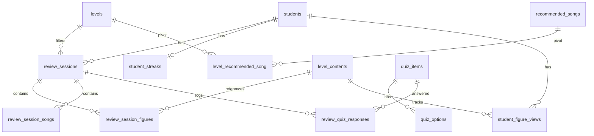

# Idea 1: Panel interactivo de repaso para alumnos

> Spec de implementación. Base existente (no se toca): gestión de cursos, cursos especiales, pagos/cuentas, preinscripciones y levels. Stack: Laravel + React (web). API con Sanctum para consumo web y futura app Flutter.

---

## Descripción

Sección web accesible sin login tradicional: el alumno se identifica con su correo o cédula (dato que ya existe en `students`), y desbloquea un panel de sesión corta con contador visible tipo juego de repaso.

**Contenido de la sesión:**

- 2 figuras para repasar (el alumno elige entre sus últimas 4 vistas)
- 3 canciones recomendadas, filtradas según el level del alumno
- Quiz interactivo estilo Duolingo: se muestra el nombre de una figura (o dato curioso del baile) y 3 descripciones; el alumno selecciona la correcta. Las preguntas continúan hasta que expire el timer.

Pensado como "anzuelo" de bajo compromiso, no reemplaza la futura app de Flutter.

**Mecánica futura:** racha de repaso (streaks) tipo "llevas 3 días repasando", sin tabla de posiciones pública.

---

## Decisiones cerradas

| Pregunta | Decisión |
|----------|----------|
| Duración de sesión | **Configurable por nivel** (campo en `levels` o tabla relacionada) |
| Cantidad de preguntas quiz | **Hasta que expire el timer** — el tiempo limitado refuerza el foco |
| Alumno sin historial de figuras | **Usar figuras marcadas en el curso** (`course_level_content_progress`). Al inicio pocos registros; irán creciendo conforme los profesores marquen figuras vistas en admin |
| Identificación | **Solo estudiantes inscritos** (`students`). Preinscripciones no tienen acceso |

---

## Estado actual del proyecto

**Ya existe:**

- `students` (email, dni)
- `levels`, `level_contents` (figuras del catálogo)
- Progreso por curso: `course_level_content_progress` (figuras marcadas como vistas por el grupo)
- API admin bajo sesión web (Fortify)

**No existe aún:**

- Repaso, música, quiz, streaks
- Laravel Sanctum
- `routes/api.php`
- Panel alumno

---

## Modelo de datos

No se modifican migraciones existentes. Tablas nuevas:

### Canciones (pivot por nivel)

```
recommended_songs
- id
- title
- artist
- audio_or_link_url
- is_active (boolean)
- timestamps

level_recommended_song (pivot)
- level_id (FK -> levels)
- recommended_song_id (FK -> recommended_songs)
- unique (level_id, recommended_song_id)
```

Una canción puede pertenecer a varios niveles.

### Sesiones de repaso

```
review_sessions
- id
- student_id (FK -> students)
- level_id (FK -> levels)
- started_at
- expires_at
- completed (boolean)
- timestamps

review_session_figures
- id
- review_session_id (FK -> review_sessions)
- level_content_id (FK -> level_contents)  ← reutiliza catálogo existente
- selected_by_student (boolean)

review_session_songs
- id
- review_session_id (FK -> review_sessions)
- recommended_song_id (FK -> recommended_songs)
```

### Historial de figuras vistas (regla 4 → 2)

```
student_figure_views
- id
- student_id (FK -> students)
- level_content_id (FK -> level_contents)
- viewed_at (timestamp)
- index (student_id, viewed_at)
```

**Regla de selección:**

1. Consultar `student_figure_views` ORDER BY `viewed_at` DESC LIMIT 4
2. Si hay menos de 4, completar con figuras de `course_level_content_progress` del curso activo del alumno
3. Si aún no hay suficientes (software nuevo), completar con figuras aleatorias del nivel
4. Mostrar las 4 al alumno; debe elegir exactamente 2
5. Guardar en `review_session_figures` con `selected_by_student = true`
6. Al ver/repasar una figura → nueva entrada en `student_figure_views`

### Quiz (pool independiente)

```
quiz_items
- id
- type (enum: figure | fun_fact)
- prompt (nombre de figura o pregunta)
- level_id (FK -> levels, nullable)
- is_active (boolean)
- timestamps

quiz_options
- id
- quiz_item_id (FK -> quiz_items)
- description
- is_correct (boolean)  ← exactamente 1 correcta por item

review_quiz_responses
- id
- review_session_id (FK -> review_sessions)
- quiz_item_id (FK -> quiz_items)
- quiz_option_id (FK -> quiz_options)
- is_correct (boolean)
- answered_at (timestamp)
```

El pool es independiente del catálogo (`level_contents`) pero puede alimentarse desde ahí. Soporta figuras y datos curiosos del baile.

### Streaks

```
student_streaks
- id
- student_id (FK -> students, unique)
- current_streak
- last_review_at
- timestamps
```

### Duración por nivel

Agregar a `levels` (nueva migración, no tocar la existente):

```
levels (columna nueva)
- review_duration_seconds (unsigned smallint, default 300)
```

---

## Diagrama de relaciones



---

## Fases de implementación

### Fase 0 — Fundamentos API (Sanctum)

| # | Paso | Detalle |
|---|------|---------|
| 0.1 | Instalar Laravel Sanctum | `composer require laravel/sanctum`, publicar config y migración |
| 0.2 | Configurar guard `student` | Provider `students` en `config/auth.php` |
| 0.3 | `HasApiTokens` en `Student` | Auth por token, no por `User` |
| 0.4 | Crear `routes/api.php` | Prefijo `/api`, middleware `auth:sanctum` |
| 0.5 | Rate limiting | Throttle en identificación (email/dni) |

### Fase 1 — Migraciones y modelos

| # | Tabla | Notas |
|---|-------|-------|
| 1.1 | `recommended_songs` | Catálogo de canciones |
| 1.2 | `level_recommended_song` | Pivot multi-nivel |
| 1.3 | `review_sessions` | Sesión con expiración |
| 1.4 | `review_session_figures` | FK a `level_contents` |
| 1.5 | `review_session_songs` | 3 canciones por sesión |
| 1.6 | `student_figure_views` | Historial para regla 4→2 |
| 1.7 | `student_streaks` | Racha de repaso |
| 1.8 | `quiz_items` | Pool figuras + datos curiosos |
| 1.9 | `quiz_options` | 3 opciones por pregunta |
| 1.10 | `review_quiz_responses` | Respuestas por sesión |
| 1.11 | `levels.review_duration_seconds` | Duración configurable por nivel |
| 1.12 | Modelos, factories, seeders | Enum `QuizItemType`: `Figure`, `FunFact` |

### Fase 2 — Lógica de negocio (Services)

| # | Service | Responsabilidad |
|---|---------|-----------------|
| 2.1 | `StudentIdentificationService` | Buscar por email o dni; solo `students` inscritos |
| 2.2 | `StudentLevelResolver` | Nivel = curso activo más reciente del alumno |
| 2.3 | `ReviewSessionService` | Crear sesión; `expires_at` según `review_duration_seconds` del nivel |
| 2.4 | `FigureSelectionService` | Últimas 4 vistas → elegir 2; fallback a progreso del curso y luego aleatorias del nivel |
| 2.5 | `SongRecommendationService` | 3 canciones del nivel vía pivot |
| 2.6 | `QuizGeneratorService` | Preguntas del pool filtrado por nivel/tipo; ciclo hasta expiración |
| 2.7 | `StreakService` | +1 si completó hoy; reset si pasó más de 1 día |

### Fase 3 — API endpoints (Sanctum)

Prefijo: `/api/review`

| # | Método | Ruta | Auth | Descripción |
|---|--------|------|------|-------------|
| 3.1 | POST | `/identify` | Público | `{ email \| dni }` → token + datos del alumno |
| 3.2 | POST | `/sessions` | Sanctum | Crear sesión de repaso |
| 3.3 | GET | `/sessions/{id}` | Sanctum | Estado + tiempo restante |
| 3.4 | GET | `/sessions/{id}/figure-options` | Sanctum | Últimas 4 figuras para elegir |
| 3.5 | POST | `/sessions/{id}/figures` | Sanctum | Enviar las 2 figuras elegidas |
| 3.6 | POST | `/sessions/{id}/figures/{content}/view` | Sanctum | Registrar visualización |
| 3.7 | GET | `/sessions/{id}/songs` | Sanctum | 3 recomendaciones musicales |
| 3.8 | GET | `/sessions/{id}/quiz/next` | Sanctum | Siguiente pregunta (hasta expirar) |
| 3.9 | POST | `/sessions/{id}/quiz/{item}/answer` | Sanctum | Registrar respuesta |
| 3.10 | POST | `/sessions/{id}/complete` | Sanctum | Completar + actualizar streak |
| 3.11 | GET | `/streak` | Sanctum | Racha actual |
| 3.12 | DELETE | `/logout` | Sanctum | Revocar token |

Respuestas JSON con API Resources para consumo web y Flutter.

### Fase 4 — Panel web (Inertia + React)

Ruta pública: `/repaso`

| # | Paso | Componente |
|---|------|------------|
| 4.1 | Identificación | Input email o cédula → token en localStorage |
| 4.2 | Layout de sesión | Contador regresivo según duración del nivel |
| 4.3 | Selección de figuras | Grid de 4 cards, selección múltiple (max 2) |
| 4.4 | Repaso de figuras | Nombre, descripción, video embed opcional |
| 4.5 | Quiz interactivo | Prompt + 3 opciones estilo Duolingo; loop hasta expirar |
| 4.6 | Recomendaciones | 3 cards con título, artista, link |
| 4.7 | Streak | Badge al completar |
| 4.8 | `reviewService.js` | Cliente API con token Sanctum |

### Fase 5 — Admin (v1.1)

| # | Recurso | Ruta |
|---|---------|------|
| 5.1 | Canciones + niveles | `/admin/recommended-songs` |
| 5.2 | Quiz items | `/admin/quiz-items` |
| 5.3 | Sesiones de repaso (lectura) | `/admin/review-sessions` |
| 5.4 | Duración de repaso por nivel | Editar en `/levels/{level}` |

### Fase 6 — Tests

| # | Test | Valida |
|---|------|--------|
| 6.1 | Identificación | Token emitido; 404 si no inscrito |
| 6.2 | Creación de sesión | Expiración según nivel |
| 6.3 | Selección de figuras | Rechaza ≠ 2; rechaza fuera de las 4 |
| 6.4 | Fallback sin historial | Usa progreso del curso y aleatorias |
| 6.5 | Canciones por nivel | Pivot multi-nivel |
| 6.6 | Quiz loop | Preguntas hasta expiración |
| 6.7 | Streak | Incremento y reset |
| 6.8 | Sesión expirada | Endpoints rechazan sesión vencida |

---

## Orden de implementación

```
Semana 1 — Backend base
├── Fase 0 (Sanctum)
├── Fase 1 (Migraciones + seeders)
└── Fase 2 (Services core)

Semana 2 — API + tests
├── Fase 3 (Endpoints completos)
└── Fase 6 (Tests feature)

Semana 3 — Frontend alumno
├── Fase 4 (Panel /repaso completo)
└── Pulido UX (timer, animaciones quiz)

Semana 4 — Admin + Flutter-ready
├── Fase 5 (CRUD admin)
└── Documentación API para Flutter
```

---

## Lo que NO se toca

- Migración `2026_04_29_000000_create_academy_schema.php`
- Tablas `level_contents`, `levels`, `students`, `courses` (solo se agrega columna vía migración nueva)
- Panel admin existente (solo se agregan secciones nuevas)

---

## Pendiente por definir

- **Múltiples cursos activos:** si el alumno está en Básico 2 e Intermedio 1, ¿qué nivel usa el repaso? Propuesta: curso activo más reciente (`enrollments` → `course.level_id`).
